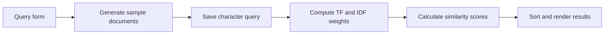

# 🔎 Information Retrieval Lab

   

A small Python project exploring how documents can be represented, scored against a query, and ranked. It contains an early command-line experiment and a later Flask interface with TF–IDF-style weighting and HITS authority/hub calculations.

## ✨ What is implemented?

- **Document scoring:** frequency-based representations and weighted query matching.
- **TF–IDF pipeline:** term frequency, normalized frequency, document frequency, and base-2 inverse document frequency.
- **Search interface:** a Flask form accepts a query and displays five document IDs with descending similarity scores.
- **Link analysis:** numeric tokens encode links between five documents; NumPy computes authority and hub vectors over 20 iterations.
- **Synthetic data:** random uppercase characters and numeric link tokens provide a small experimental dataset.

## 🧭 Repository map

```text
project/
  Test.py                   # Initial three-document CLI experiment
  D1.txt, D2.txt, D3.txt     # Regenerated when Test.py runs
project2 with interface/project2/
  routing.py                # Flask app, scoring, data generation, HITS
  test2.py                  # Earlier scoring experiment, not a test suite
  1.txt ... 5.txt            # Five-document corpus
  input.txt                 # Query representation
  templates/home.html       # Query form and ranked results
```

## 🚀 Run the web prototype

Use Python 3 and an isolated environment. The repository does not pin dependency versions.

```sh
git clone https://github.com/sa5ra2000/project-ir.git
cd project-ir
python -m venv .venv
```

Activate the environment (`.venv\Scripts\activate` on Windows Command Prompt, or `source .venv/bin/activate` on macOS/Linux), then:

```sh
python -m pip install flask numpy
cd "project2 with interface/project2"
python routing.py
```

Open `http://127.0.0.1:5000/` and try an uppercase query such as `ABC`. Run from the directory shown because document paths are relative to the working directory.

> [!IMPORTANT]
> A non-empty search regenerates the corpus files and writes `input.txt`. Use a disposable copy if you want to preserve the bundled samples. Flask debug mode is enabled in the source.

For the original CLI experiment, run `python Test.py` from `project/` and enter three character/weight pairs when prompted. This script also overwrites its sample documents.

## 🔄 How a query travels



## 📍 Current stage and limitations

This is a learning prototype, with an interactive search path and separate link-analysis calculations already present. HITS results are printed at startup; they are not incorporated into the web ranking.

- Queries are split into individual characters, rather than natural-language words.
- Corpus regeneration makes repeated searches non-deterministic.
- The normalization maximum is shared across documents rather than reset per document.
- The similarity denominator uses document weights only for terms present in the query, so it differs from standard full-vector cosine similarity.
- The query is included in the collection used for IDF calculations.
- HITS assumes exactly five documents and does not handle a zero normalization norm explicitly.
- There is no automated test suite or pinned environment. `test2.py` references `d1.txt`–`d5.txt`, which are not the numbered files included beside it.

## 🛠️ Possible next steps

- [ ] Keep a fixed corpus and separate data generation from search.
- [ ] Correct and test normalization and cosine similarity against known examples.
- [ ] Add word tokenization and a configurable corpus size.
- [ ] Display HITS scores in the interface.
- [ ] Pin dependencies and add automated tests.

These are proposed improvements, not completed features. Setup instructions are based on the checked-in source; no runtime compatibility claim is implied.
